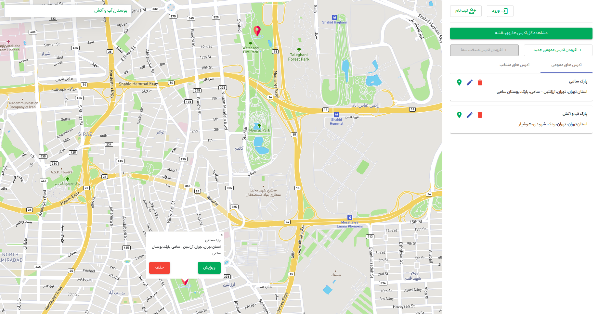

# Map

## Demo




## Usage

Go to server/favorite-address-mock-server directory and

- Install packages

    ```bash
    npm install
    ```

- Start the server

    ```bash
    npm start
    ```

Go to base directory and 

- Install Project

    ```bash
    npm install
    ```

- Start the project

    ```bash
    npm start
    or
    ng serve
    ```
